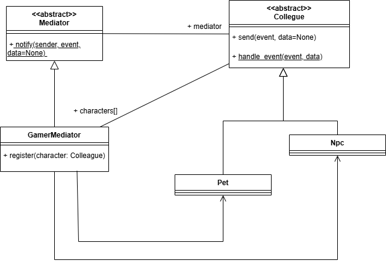

# Лаборатория №3
# Поведенчиские паттерны
   Для выполнения лабораторной работы был определен структурный паттерн проектирования **Посредник** (*Mediator*) .

## Предметная область
   Взаимодействие между персонажами, поиск и обмен предметами.

## Описание проблемы
    -Когда имеется множество взаимосвязаных объектов, связи между которыми сложны и запутаны.
    -Когда необходимо повторно использовать объект, однако повторное использование затруднено в силу сильных связей с другими объектами.

## Решение
   Использование паттерна **Посредник**. 
   представляет такой шаблон проектирования, который обеспечивает взаимодействие множества объектов без необходимости ссылаться друг на друга. Тем самым достигается слабосвязанность взаимодействующих объектов.

-**Класс Коллега (Collegue)** — абстрактный класс персонажей, которые взаимодействуют между собой.
-**Персонажи (Pet, Npc)** — реализует персонажей.  

-**Посредник (Mediator)** — абстрактный класс-посредник, который обеспечивает взаимодействие между объектами.  
-**GameMediator** — конкретная реализация посредника

**Методы**
   notify(self, sender, event, data=None) — абстрактный метод в классе Mediator.
   send(self, event, data=None) — реализованный метод в классе Colleague.
   handle_event(self, event, data) — абстрактный метод в классе Colleague.
   register(self, character: Colleague) — реализованный метод в классе GameMediator.

**Атрибуты**
   mediator — атрибут экземпляра класса Colleague, хранит ссылку на объект посредника (Mediator).
   characters — список персонажей, зарегистрированных в посреднике (GameMediator).

# Диаграмма классов

# Без паттерна
Взаимодействие между персонажами реализуется напрямую, без использования посредника. Объекты взаимодействуют друг с другом, вызывая методы или изменяя свойства напрямую, что приводит к сильной связанности между ними.

Минусы без паттерна:  
  -Высокая связность между объектами, что усложняет поддержку и расширение системы.  
  -Меньшая гибкость в управлении взаимодействиями и поведением персонажей во время выполнения программы.
