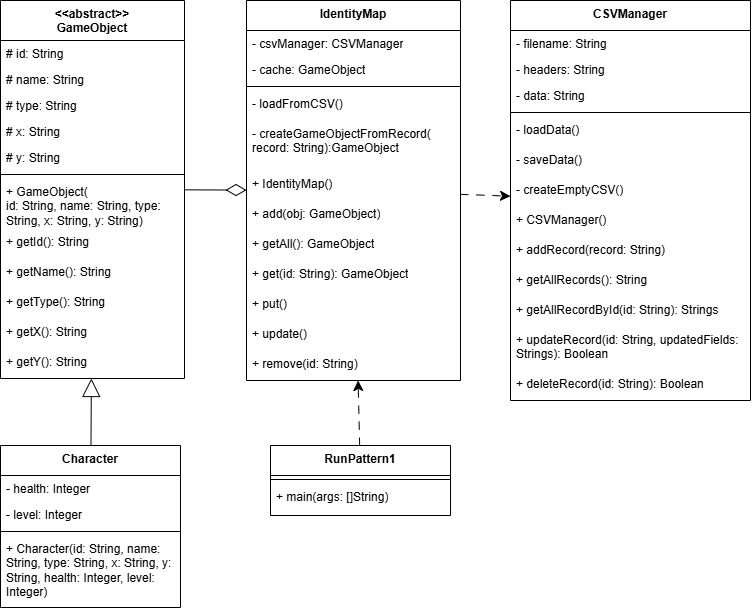

# Лаборатория №4
# Поведенчиские паттерны
   Для выполнения лабораторной работы был определен архитектурный паттерн проектирования **Коллекция объектов** (*Identity Map*) .

## Предметная область
   Управление коллекцией взаимосвязанных объектов — персонажей и предметов в игре, с целью избегания дублирования объектов и ускорения поиска.

## Описание проблемы
    -При наличии большого числа объектов (персонажей, предметов) необходимо обеспечить эффективное управление ими.
    -Часто возникает необходимость повторного получения уже существующего объекта по его уникальному идентификатору.

## Решение
   Использование паттерна **Коллекция объектов** (*Identity Map*). 
   централизованное хранилище объектов, которое обеспечивает: 
   -уникальное хранение каждого объекта по его идентификатору.
   -быстрый доступ к объекту по ID. 

-**GameObject** — абстрактный класс для игровых объектов.
-**IdentityMap** — коллекция объектов.  
-**Character** — пример класса персонажей.
-**Main** — основной класс для демонстрации.

**Методы**
   -notify(self, sender, event, data=None) — абстрактный метод в классе Mediator.
   -send(self, event, data=None) — реализованный метод в классе Colleague.
   -handle_event(self, event, data) — абстрактный метод в классе Colleague.
   -register(self, character: Colleague) — реализованный метод в классе GameMediator.

**Атрибуты**
   -mediator — атрибут экземпляра класса Colleague, хранит ссылку на объект посредника (Mediator).
   -characters — список персонажей, зарегистрированных в посреднике (GameMediator).

# Диаграмма классов

# Без паттерна
п

Минусы без паттерна:  
  -
